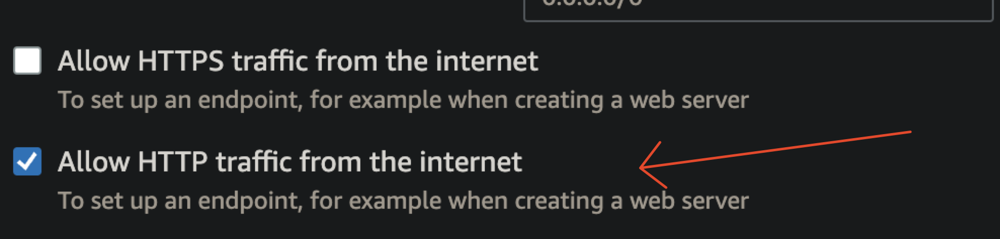

# Node.js Web Counter
This project is a recreation of a web counter  used as an
example in previous assignment for running through gunicorn, or on AWS, recreated with Node.js, displaying the counter as HTML code, through an DOM implementation for Node, JSDOM, running in a Docker container, getting, and incrementing the count through a Docker Volume, within a remote server (AWS EC2).


*Sorry this increments by 2, implementing this took **forever...***

## Setup

### Local Dependencies
Make sure that Node.js and npm are both installed on your system.

### Cloud Dependencies 
Make sure that Git and Docker are installed.

Amazon Linux has Docker in its repos, [Ubuntu](https://docs.docker.com/engine/install/ubuntu/) and [Red Hat](https://docs.docker.com/engine/install/rhel/) do not, use the Docker-CE repo for those, and replace `docker` with `docker-ce` in their respective installations.

RPM-based distros (Amazon, RHEL):
```bash
sudo yum in git docker -y
```

DEB-based distros (Ubuntu, Debian), through Docker CE:
```bash
sudo apt install git docker-ce docker-ce-cli containerd.io docker-buildx-plugin docker-compose-plugin
```

Enable and start the Docker systemd service.

```bash
sudo systemctl enable --now docker.service
```

## Getting the Application
Clone this repository.
``` bash
git clone https://github.com/cs220s23/david-node-counter && cd david-node-counter
```
### Run locally on your host system
Install npm modules:
```bash
npm install
```
Run as superuser (to expose port 80):
```bash
sudo node app.js
```
Access the counter on a web browser by typing `localhost:80`.

Terminate the server by running Ctrl-X in the terminal, or kill the process.
### Docker
Build this repository in a new Docker image, tagged `counter` (omit sudo on all commands if running Docker on macOS)
``` bash
sudo docker build -t counter .
```
Then, run the container (assuming it has the tag `counter`), with port 80, in detached mode, giving the container the name `counter`, mounting the folder `data` (in this repo) on `/app/data` in the container for persistence.
```bash
sudo docker run -d -p 80:80 -v $(pwd)/data:/app/data --name counter counter
```
Access the program on a web browser on `localhost:80` if running Docker locally, or on the public IPv4 address of the remote instance, on port 80 if using such.

Stop the container (with the name `counter`) by running
```bash
sudo docker rm -f counter
```
## Reset the counter
Delete the `data` folder to reset the number on the counter.
## Automated scripts
Alternatively, if typing (or copy-pasting) numerous commands is too cumbersome, if Docker is already installed in the instance, run the `up` and `down` files to build and run the Docker container of the program, and to terminate it respectively.

Make sure both the `up` and `down` scripts have executable permissions
```bash
chmod +x up down
```

Run the script (replace with `down` to remove the containers)
```bash
sudo ./up
```

## EC2 Instance Setup
Make sure that the instance has HTTP access in Network Settings (port 80), so that way a web browser can access it.


### EC2 User Data
**This script is for Amazon Linux only!!**

Take the contents of `userdata.sh`, and put in into the "User Data" option in "Advanced Settings" upon the creation of an EC2 instance.

This script should install git, Docker, as well as clone this repository, and enter into it.

From that point you should be able to run the `up` and `down` scripts to automate the launching of the container.
## Resources Used
- [Node.js](https://nodejs.org)
- [JSDOM](https://github.com/jsdom/jsdom)
- [Docker](https://docker.org)
- [Amazon ECS](https://aws.amazon.com/ecs/)
